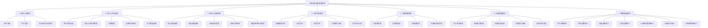

```mermaid
graph TD
    %% Root Node
    Root[共享单车调度管理系统]

    %% Level 1 Modules
    M1[1. 登录认证模块]
    M2[2. 用户与会员模块]
    M3[3. 网点与设备模块]
    M4[4. 订单交易模块]
    M5[5. 优惠营销模块]
    M6[6. 运维调度模块]
    M7[7. 数据看板模块]

    %% Level 2 Functions
    M1_1[用户注册]
    M1_2[用户登录]
    M1_3["身份校验/会话维护"]

    M2_1[用户信息管理]
    M2_2[实名认证状态管理]
    M2_3[余额管理]
    M2_4[信用积分管理]
    M2_5[会员等级管理]

    M3_1[网点信息管理]
    M3_2[网点容量管理]
    M3_3[设备信息管理]
    M3_4[设备状态管理]
    M3_5["电量/维修时间管理"]

    M4_1[创建租借订单]
    M4_2[归还订单]
    M4_3[取消订单]
    M4_4[订单费用计算]
    M4_5[交易流水记录]

    M5_1[优惠券发放]
    M5_2[优惠券查询]
    M5_3[优惠券核销]
    M5_4[优惠券失效处理]

    M6_1[员工信息管理]
    M6_2[维修记录管理]
    M6_3[调度任务创建]
    M6_4[调度任务接单]
    M6_5[调度任务完成]

    M7_1[用户总数统计]
    M7_2[网点总数统计]
    M7_3[设备总数统计]
    M7_4[订单总数统计]
    M7_5[已使用优惠券统计]
    M7_6[调度任务统计]
    M7_7[待维修故障统计]

    %% Connections
    Root --- M1
    Root --- M2
    Root --- M3
    Root --- M4
    Root --- M5
    Root --- M6
    Root --- M7

    M1 --- M1_1
    M1 --- M1_2
    M1 --- M1_3

    M2 --- M2_1
    M2 --- M2_2
    M2 --- M2_3
    M2 --- M2_4
    M2 --- M2_5

    M3 --- M3_1
    M3 --- M3_2
    M3 --- M3_3
    M3 --- M3_4
    M3 --- M3_5

    M4 --- M4_1
    M4 --- M4_2
    M4 --- M4_3
    M4 --- M4_4
    M4 --- M4_5

    M5 --- M5_1
    M5 --- M5_2
    M5 --- M5_3
    M5 --- M5_4

    M6 --- M6_1
    M6 --- M6_2
    M6 --- M6_3
    M6 --- M6_4
    M6 --- M6_5

    M7 --- M7_1
    M7 --- M7_2
    M7 --- M7_3
    M7 --- M7_4
    M7 --- M7_5
    M7 --- M7_6
    M7 --- M7_7

```